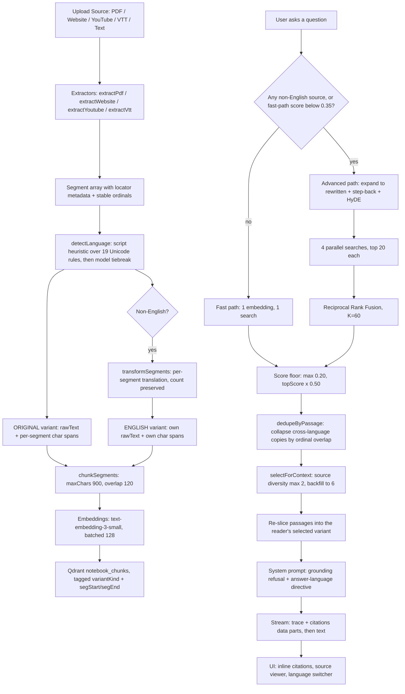

# Pensieve — Grounded AI Notebook & Research Vessel

> A vessel for your knowledge sources. Pensieve cuts PDFs, websites, YouTube videos, and caption files into precise segments, indexes them into a Qdrant vector database, and streams grounded answers with exact position citations (`p.4`, `41:12`, `Heading`) that open the source at the cited spot.

---

## What it does

Give it documents. It splits them into segments that remember where they came from, embeds them, and when you ask a question it retrieves only the passages that are actually about your question and hands those to the model as a reading packet. Nothing is fine-tuned; the model stays as ignorant as it started. Every claim in an answer is traceable back to a page number or a timestamp.

On top of that grounding layer sits a studio of generated artifacts — audio overviews, mind maps, flashcards, quizzes, briefings — all built from the same indexed sources.

---

## Features

### Retrieval & grounding

- **Exact locator pipeline (`Segment[]`)** — position metadata (`page`, `startSec`, `endSec`, `heading`, `charStart`, `charEnd`, `segStart`, `segEnd`) is preserved end-to-end as typed data, never as string markers baked into the text.
- **Character-offset slice highlighting** — the viewer highlights `rawText.slice(charStart, charEnd)` wrapped in `<mark>` and auto-scrolls to it. No fuzzy string matching.
- **Two-tier retrieval strategy** — an all-English notebook takes the fast path (one embedding, one search). If the top score lands below `FAST_PATH_CONFIDENCE = 0.35`, or the notebook has any non-English source, it escalates to the advanced path: LLM query expansion into three variants (rewritten query, step-back query, HyDE passage), four parallel searches, then **Reciprocal Rank Fusion** at `K_RRF = 60`.
- **Precision relevance floor** — candidates are filtered at `max(0.20, topScore × 0.50)`, with a soft fallback to the top 3 when the top score still clears `0.18`. Survivors are deduped across language variants, then selected for source diversity (max 2 per source) and backfilled to a 6-chunk budget.
- **Honest refusal** — ask something the sources don't cover and the floor drops every candidate, so the assistant says so instead of inventing an answer.

### Multilingual

- **Three renderings per source: Original / English / Romanized** — a non-English source is translated segment by segment at ingest, and *both* renderings are embedded, so a question retrieves well in either language. A romanized rendering (Hinglish for Hindi, Romaji for Japanese, …) is generated on first request and cached.
- **Segment-ordinal anchors** — character offsets differ between translations, so citations anchor to *segment ordinals*, which translation preserves one-to-one. That single anchor powers cross-language highlighting, cross-variant dedupe, and page/timestamp reuse — with no offset-remapping layer.
- **Answer-language following** — switching language in the chat header switches the language answers are written in; leave it alone and the language is inferred from the question's script.

### Studio

- **Audio overview** — a script written by `gpt-4o-mini` in one of four personas (Casual, Academic, ELI5, Debate), spoken by `tts-1` in one of six voices (Alloy, Nova, Onyx, Echo, Fable, Shimmer), with a synchronized clickable transcript, 0.75×–2× playback, and MP3 download.
- **Mind map** — a Mermaid knowledge graph rendered as either a zoomable diagram or a collapsible tree with a node inspector; exportable as Mermaid source.
- **Flashcards & quiz** — 10 flip cards and a 6-question multiple-choice quiz with explanations, generatable in English, Hinglish, Hindi, Spanish, French, or German.
- **Executive briefing & study guide** — long-form Markdown documents rendered for reading, copy, download, or print.
- **Notes** — a Markdown scratchpad with search, debounced autosave, edit/preview toggle, and **Pin to Note** straight from any assistant message.

### Workspace

- **Five source types** — PDF, Website URL, YouTube, raw Text, and VTT caption files, plus drag-and-drop bulk upload onto the source rail.
- **Live ingestion status** — sources poll every 3s through `QUEUED → EXTRACTING → TRANSLATING → EMBEDDING → READY`, with per-source re-index and delete.
- **Command palette (`⌘K`)** — search sources, notes, and starter prompts.
- **Public sharing** — mint a `ps_…` share token and publish a read-only link at `/share/{token}`.
- **Dark mode** — a theme toggle persisted to `localStorage`, driven by CSS custom properties.
- **Clerk authentication** — sign in to own your notebooks. Notebooks created while signed out are owner-less and remain open (see [Auth model](#auth-model)).

---

## Technical stack

| Layer | Choice |
| --- | --- |
| Framework | Next.js 14 (App Router, Server Components, Server Actions) |
| Auth | Clerk (`@clerk/nextjs`) |
| Database | PostgreSQL via Prisma 5 |
| Vector DB | Qdrant — collection `notebook_chunks`, 1536-dim, cosine distance |
| LLM | OpenAI `gpt-4o-mini` (answers, translation, language ID, all studio generation) |
| Embeddings | OpenAI `text-embedding-3-small` (1536-dim) |
| Speech | OpenAI `tts-1` |
| AI plumbing | Vercel AI SDK (`ai`, `@ai-sdk/openai`, `@ai-sdk/react`) |
| Extractors | `unpdf` (PDF), `cheerio` (web), `youtube-transcript` (captions), hand-rolled WEBVTT parser |
| Styling | Tailwind CSS over CSS custom-property tokens (`--ink`, `--vessel`, `--surface`, `--rule`, `--accent`, `--found`) |
| Fonts | Instrument Serif, Inter, JetBrains Mono |
| Diagrams | `mermaid` (dynamically imported) |

---

## Architecture flow



### Why segment ordinals

Translating a source changes every character offset, so a citation found in the English index cannot be highlighted in the Hindi text using offsets. Translation *is* one-to-one per segment, though, so segment ordinals survive it. Each variant stores its own `[charStart, charEnd]` per ordinal, and `spanForSegmentRange()` converts an ordinal range into offsets for whichever variant is on screen. The same anchor tells the retriever that a Hindi hit and an English hit covering overlapping ordinals are one passage, not two.

`assembleVariant()` emits exactly one span per input segment — *including empty ones* — so ordinals stay aligned even when a translation renders a segment as nothing. `transformSegments()` guarantees `output.length === input.length` through a three-tier recovery (two whole-batch attempts, then per-segment retries, then pass the original text through untransformed), because a single dropped segment would shift every ordinal after it.

---

## Tuning constants

Everything worth turning a knob on, and where it lives.

| Constant | Value | Location |
| --- | --- | --- |
| `DEFAULT_MAX_CHARS` | `900` | `src/lib/chunking.ts` |
| `DEFAULT_OVERLAP` | `120` | `src/lib/chunking.ts` |
| `EMBEDDING_MODEL` / `EMBEDDING_DIMENSIONS` | `text-embedding-3-small` / `1536` | `src/lib/embeddings.ts` |
| `MAX_INPUTS_PER_REQUEST` | `128` | `src/lib/embeddings.ts` |
| `INDEX_BATCH_SIZE` | `128` | `src/lib/variants.ts` |
| Translation `BATCH_SIZE` / `CONCURRENCY` | `30` segments / `6` batches | `src/lib/translate.ts` |
| `CHAT_MODEL` | `gpt-4o-mini` | `src/lib/llm.ts` |
| `K_RRF` | `60` | `src/lib/ragPipeline.ts` |
| Search top-K per query | `20` | `src/lib/ragPipeline.ts` |
| `FAST_PATH_CONFIDENCE` | `0.35` | `src/app/api/chat/route.ts` |
| `ABSOLUTE_FLOOR` | `0.20` | `src/app/api/chat/route.ts` |
| `RELATIVE_FLOOR_RATIO` | `0.50` | `src/app/api/chat/route.ts` |
| `MAX_CONTEXT_CHUNKS` / `MAX_PER_SOURCE` | `6` / `2` | `src/app/api/chat/route.ts` |

---

## Project layout

```
src/
├── app/
│   ├── actions/notebooks.ts        Server actions: create / rename / delete notebook
│   ├── api/                        Route handlers (see API reference)
│   ├── notebook/[id]/page.tsx      The workspace
│   ├── share/[token]/page.tsx      Public read-only view
│   └── sign-in, sign-up            Clerk catch-all routes
├── components/                     Workspace UI, studio modals, viewers
├── hooks/useReadingVariant.ts      Cross-component language state (localStorage + CustomEvent)
└── lib/
    ├── extractors.ts               PDF / website / YouTube / VTT / plain text → Segment[]
    ├── segments.ts                 Variant text layout; the ordinal ↔ offset bridge
    ├── chunking.ts                 Segment[] → Chunk[] with unified locators
    ├── embeddings.ts               Batched, retried, order-preserving embedding calls
    ├── language.ts                 Script-first language detection (19 Unicode rules)
    ├── translate.ts                Batched translation / romanization, length-guaranteed
    ├── variants.ts                 Variant CRUD + per-variant Qdrant indexing
    ├── ingest.ts                   The ingestion orchestrator
    ├── ragPipeline.ts              Fast search, advanced search, RRF fusion
    ├── retrieval.ts                Dedupe, diversity selection, variant inference
    ├── qdrant.ts                   Client + idempotent collection provisioning
    └── authz.ts                    Notebook / source ownership guards
```

---

## API reference

| Route | Methods | Purpose |
| --- | --- | --- |
| `/api/chat` | `GET`, `POST` | History; streaming grounded answer with trace + citation data parts |
| `/api/sources` | `GET`, `POST`, `DELETE` | List, ingest, remove (also purges vectors) |
| `/api/sources/[id]` | `GET` | Full source payload for the viewer |
| `/api/sources/[id]/reindex` | `POST` | Re-run extraction, chunking, embedding |
| `/api/sources/[id]/variants` | `GET`, `POST` | List renderings; generate one on demand |
| `/api/notebooks/[id]/languages` | `GET` | Available language switcher options |
| `/api/notebooks/[id]/share` | `GET`, `POST` | Read and toggle public sharing |
| `/api/notes`, `/api/notes/[id]` | `GET`, `POST`, `PUT`, `DELETE` | Notes CRUD |
| `/api/audio-summary` | `POST` | Persona script + TTS audio as a data URL |
| `/api/mindmap` | `POST` | Mermaid graph + structured node list |
| `/api/study-tools` | `POST` | `flashcards` (10) or `quiz` (6 MCQs) |
| `/api/export-briefing` | `POST` | `briefing` or `study-guide` Markdown |

Ingestion is kicked off **without awaiting** so the request returns immediately. That works on a long-lived server; on a serverless platform the function can be frozen mid-ingest, leaving a source stuck in `EXTRACTING`. Use the re-index endpoint to recover, or move ingestion to a queue before deploying serverless.

---

## Auth model

Clerk middleware attaches auth context but does not itself protect routes — authorization is per-route, via `loadOwnedNotebook` / `loadOwnedSource` in `src/lib/authz.ts`.

The deliberate rule: **a notebook with `userId === null` is open to everyone.** That is what lets you try the app without signing up. Ownership only fails closed once a notebook has a non-null owner that doesn't match the caller. Signing in later does not retroactively claim notebooks you made as a guest.

Practical consequences:

- Signed out, you can create, read, chat with, and delete owner-less notebooks — including ones another guest made.
- Flashcards and quizzes require a session (`/api/study-tools` gates on `userId` before any ownership check), so they fail for guests even on an owner-less notebook.
- See [Known gaps](#known-gaps) before exposing this to the open internet.

---

## Environment variables

Copy `.env.example` to `.env` and fill in:

| Variable | Description |
| --- | --- |
| `DATABASE_URL` | PostgreSQL connection string |
| `OPENAI_API_KEY` | Used for embeddings, chat, translation, and TTS |
| `QDRANT_URL` | Qdrant Cloud or local cluster (e.g. `https://xxx.qdrant.tech:6333`) |
| `QDRANT_API_KEY` | Qdrant API key (omit for a local cluster) |
| `NEXT_PUBLIC_CLERK_PUBLISHABLE_KEY` | From your Clerk application's API Keys page |
| `CLERK_SECRET_KEY` | Same page |
| `QDRANT_COLLECTION_READY` | Set to `"true"` once the collection exists, to skip the check on cold starts |

---

## Quickstart

```bash
npm install
```

```bash
npx prisma db push
```

Optionally pre-create the Qdrant collection and its payload indexes. The app calls `ensureCollection()` on ingest and search anyway, so this is a convenience rather than a prerequisite:

```bash
npm run setup:qdrant
```

```bash
npm run dev
```

Visit `http://localhost:3000`.

### Scripts

| Script | What it does |
| --- | --- |
| `npm run dev` | Next.js dev server |
| `npm run build` | `prisma generate && next build` |
| `npm start` | Production server |
| `npm run lint` | `next lint` |
| `npm run setup:qdrant` | Provision the `notebook_chunks` collection and payload indexes |

---

## Walkthrough

1. **Create a notebook** from the homepage, or hit **Try a sample note** on the empty state to ingest a built-in quantum computing primer.
2. **Add sources** — a PDF, a YouTube URL, a website, or drop `.pdf` / `.vtt` files onto the source rail. Watch the status dot move through `EXTRACTING → EMBEDDING → READY`. An auto-generated overview message lands in the chat when ingestion completes.
3. **Ask a grounded question.** Answers stream in with inline superscript citations.
4. **Click a citation.** The source viewer opens at the exact page or timestamp with the passage highlighted — PDFs jump to `#page=N`, YouTube embeds start at the cited second.
5. **Ask something off-topic.** The relevance floor drops every candidate and the assistant refuses rather than hallucinating.
6. **Open the Studio rail** for an audio overview (try switching persona and voice), a mind map, flashcards, a quiz, or a briefing.
7. **Add a Hindi YouTube video.** The status passes through `TRANSLATING`. Use the language switcher (`हिन्दी (original)` / `English` / romanized) in the viewer header — the romanized rendering is generated on first click and cached. Ask in English about the Hindi video and the citations still carry the right timestamps; switch the chat language and the answer comes back in that language, citing the same spots.
8. **Share it.** Toggle sharing in the header to mint a public `/share/{token}` link.

---

## Known gaps

Honest state of things, so nobody deploys this on a bad assumption.

- **Several endpoints under-check ownership.** `/api/notes` and `/api/notes/[id]` have no auth at all; `GET /api/notebooks/[id]/share` is unauthenticated and will return any notebook's share token; `POST` on that route plus `/api/mindmap` and `/api/export-briefing` require *a* session but never verify it's the owner's. Harden these before exposing the app publicly.
- **The public share page renders the full read-write workspace.** Despite the "Public Read-Only" badge, visitors get source add/delete, the notes editor, and chat.
- **`RetrievalTrace` is built but not mounted.** The chat route emits the full trace payload and `ChatPanel` parses and stores it, but no component renders it yet. The pipeline visualizer in the header is a separate, hard-coded explainer.
- **Ingestion is fire-and-forget**, as described in the API reference.
- **`AudioPlayer` and `AnimatedGuideDialog` are dead code**, superseded by the inline player in `AudioOverviewModal` and by `CartoonGuideTour`.
- **The guide tour's dismissal isn't persisted**, so it reappears on every page load.

---

## Further reading

[`docs/concepts.md`](docs/concepts.md) is the long-form design narrative — the mental model behind RAG as implemented here, the build phase by phase, and a glossary. Start there if you want the *why*; this README is the *how to run it*.
